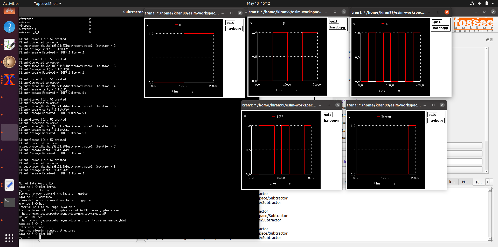

#### problems faced with nghdl of esim

1. Only std logic and std_logic_vector data types usable not bit
2. vector data type used in nghdl --> coverts to multiple pins in schematic to but on converting from kicad to simulation--> doesn't recognise data type
3. The graphs aren't plotted accordingly even after data on the ngspice terminal is received accurately.

Here
* Borrow has value 0 1 1 1 0 0 0 1 as can be seen on the ngspice terminal
* but that isn't reflected in plot
* rest all plots are perfect
